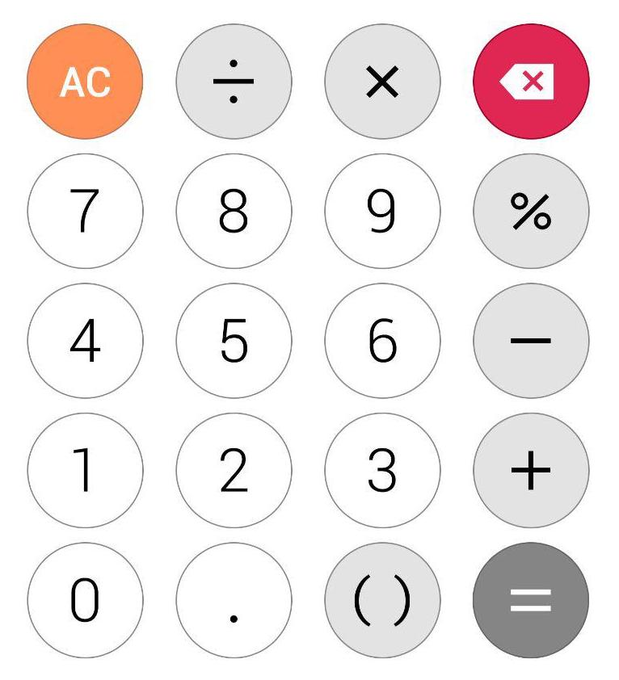

# Caclculator app

A simple calculator app written with React Native and Expo. The project used for educational purposes in [React Native from scratch course](https://github.com/triplea24/kntu-react-native-class) in **K.N. Toosi university of technology.**

## Assignment

Implement the following wireframe using Expo.

1. Use your own written custom components for buttons
2. Use state in App.js to handle input
3. Clean the code as much as you can

#### Bonus
1. Try to clean the code using Higher-Order function
2. Write component generator (Higher-Order Component) to make the code even less

## Instruction

1. First clone the repository

		git clone https://github.com/triplea24/kntu-react-native-calculator.git
	
2. Then change directory to the project
	
		cd kntu-react-native-calculator
	
3. Install node packages
	
		yarn (install)
	
	or	
	
		npm install
	
4. Run the project

		expo start
	