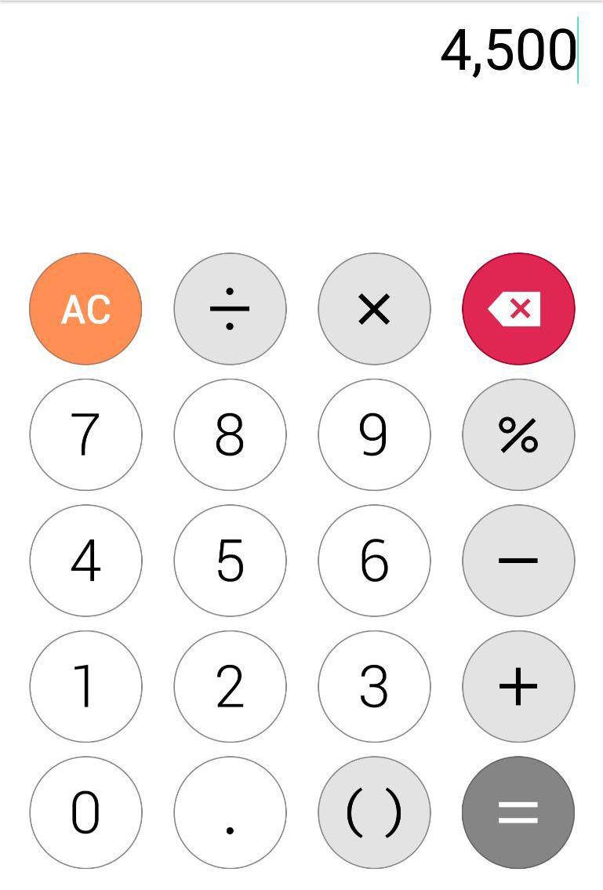

# Caclculator app

A simple calculator app written with React Native and Expo. The project used for educational purposes in [React Native from scratch course](https://github.com/triplea24/kntu-react-native-class) in **K.N. Toosi university of technology.**

## Assignment

Implement the following wireframe using Expo.

## Instruction

1. First clone the repository

		git clone https://github.com/triplea24/kntu-react-native-calculator.git
	
2. Then change directory to the project
	
		cd kntu-react-native-calculator
	
3. Install node packages
	
		yarn (install)
	
	or	
	
		npm install
	
4. Run the project

		expo start
	